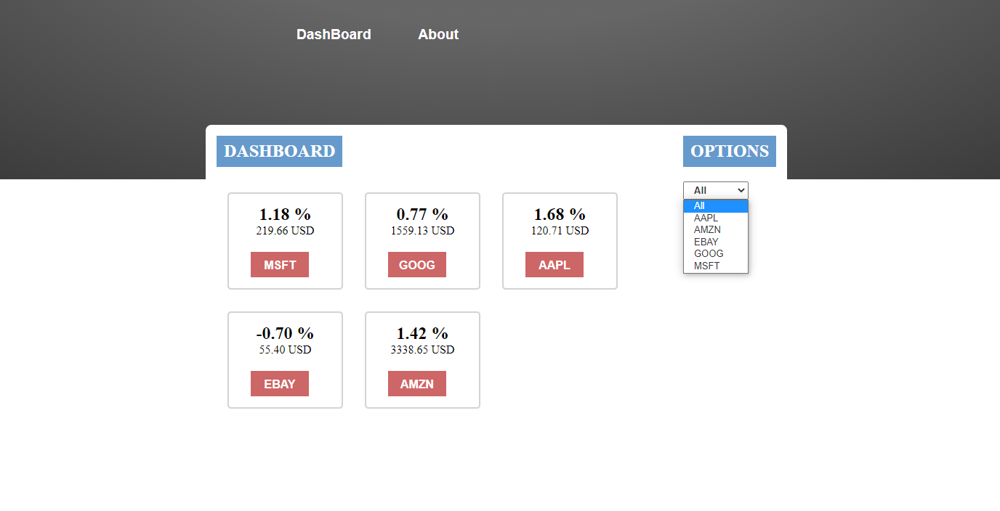

# React Catalogue
> A calogue build with React and Redux.



<br>This project was made to practice all aspects involved in creating a React application.<br>

## Content
* [Live Demo](#live-demo)
* [Requirements](#requirements)
* [Requisites](#built-with)
* [Built With](#built-with)
* [Future Improvements](#future-improvements)
* [Getting Start](#getting-start)
* [Contributing](#contributing)
* [Author](#author)
* [License](#license)

## Live Demo
You can access a online version at:<br>
https://stock-catalogue.herokuapp.com/

## Requirements
- [x] Implement a catalog with React and Redux
- [x] Setup workflow (Without create-react-app)
- [x] Fetch data from API and store into Redux
- [x] It should have routes and nested routes
- [x] Stateless filter to slice the data
- [x] Make use of Hooks, and only funcitonal components
- [x] Deploy it live

## Requisites
* [A modern web browser](https://www.google.com/chrome/)
* [Node JS](https://nodejs.org/en/download/)

## Built With
- Javascript <br>
- HTML/CSS <br>
- React and Redux <br>
- Express <br>
- Webpack and babel <br>
- JEST and React testing library for tests <br>
- ESlint and Stylelint (Linters) <br>
- GitHub Actions (CI Tool) <br>
- Netlify (Server and CD tool) <br>
- Git, Github and VScode <br>

## Future Improvements
- Realtime chart from state
- More filters
- Loading animation while fetch

## Getting Start

#### Get a local copy
Now you need a copy of this application, if you are using Git:
```js
git clone git@github.com:SevlaMare/Catalogue.git
```
Otherwise just hit (Download Zip) on green button (Code) at top of this page.

#### Open terminal
Open your terminal inside the game folder, and paste the following commands:

#### Download all dependencies
```js
npm install
```

#### Compile
```js
npm run build
```

#### Start the server
```js
npm run go
```

#### Go to a web browser (Like Google Chrome) and visit:
```js
localhost:7000
```

#### Run tests
Unit and integration tests
```npm run test```

E2E, first, need the app running:
```npm run build```
```npm run go```
and so run tests
```npm run e2e```

## Contributing

Contributions, issues and feature requests are welcome!

You can do it on [issues page](issues/).

### Acknowledgments

A special thanks for the code reviewers.

## Author

👤 **Thiago Miranda**

- Github: [@SevlaMare](https://github.com/SevlaMare)
- Twitter: [#SevlaMare](https://twitter.com/SevlaMare)
- Linkedin: [SevlaMare](https://www.linkedin.com/in/sevla-mare)

## License
Design idea based on Catalogue of Dog Clothes by [Denys Chagaida on Behance](https://www.behance.net/chagaida)
#### MIT
